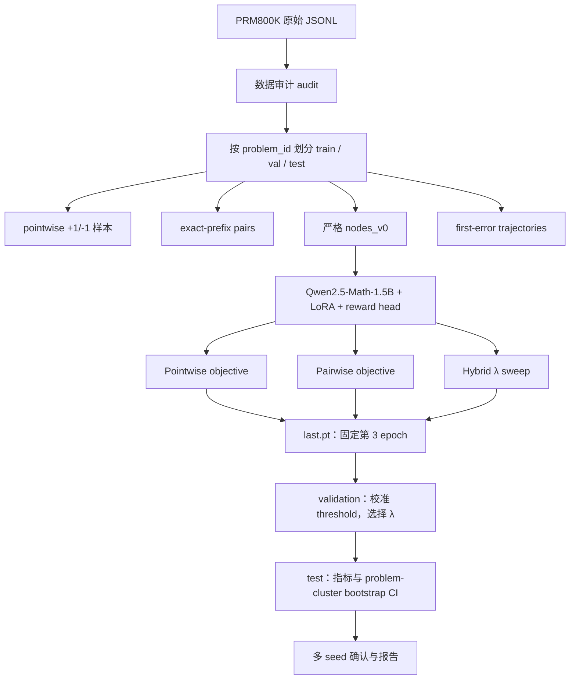

# Linux、Slurm 与 PRM 项目实操学习手册（26SS）

> 适用项目：`Process_Reward_LLMs/projects/step_preference_prm`
>
> 手册版本：2026-08-07
> 面向读者：刚开始使用 Linux 集群、Slurm 和大模型训练环境的研究生。

---

## 0. 如何使用这份手册

这不是一份要求你盲目复制命令的清单，而是一条实验操作和学习路线。每个阶段都回答四个问题：

1. **做什么？** 要执行哪些具体操作；
2. **为什么？** 这一步防止什么错误，或验证什么假设；
3. **如何判断通过？** 哪些文件、日志或数值必须出现；
4. **应该学会什么？** 换一个项目也可以复用的知识。

建议先读完第 1–5 节，再按第 6 节的顺序实际执行。不要因为后面出现了“正式训练”就跳过 smoke、token profile 和 pilot：在集群上，排队和浪费 GPU 时间通常比多花半小时检查昂贵得多。

### 0.1 当前项目口径与资料优先级

本手册以 26SS 项目中下面两份当前文档和实际代码为准：

- [`2026-08-06_pre_training_fixes_and_checkpoint_policy_zh.md`](2026-08-06_pre_training_fixes_and_checkpoint_policy_zh.md)：最新训练前修正与 checkpoint 决策；
- [`TRAINING_AUDIT_AND_UNICLUSTER_GUIDE.md`](../projects/step_preference_prm/TRAINING_AUDIT_AND_UNICLUSTER_GUIDE.md)：当前 UniCluster 执行顺序、资源方案与实验口径；
- `experiments/unicluster/*.sbatch`：真正提交给 Slurm 的作业脚本；
- `src/prm_pref/`：训练和评估的真实实现。

`RUNBOOK_V0.md` 是早期 encoder baseline 的历史说明，不能替代当前 Qwen-LoRA 主实验方案。

### 0.2 当前状态快照

截至 2026-08-07，本地已经具备：

- 原始 PRM800K、processed data、严格训练 nodes 和 trajectory 数据；
- 数据一致性校验通过；
- 17 个单元测试通过；
- 使用小型 Qwen backbone 的本机 CPU smoke 输出。

但 `outputs/runs/` 还没有正式实验结果。因此当前阶段是：**本地代码路径已验证，下一步是在 UniCluster 上完成生产 backbone 的 GPU smoke、pilot 和正式实验。** 本机 smoke 的数值没有科学意义，不能写进报告结论。

---

## 1. 先建立全局图：你最终要完成什么？

项目训练的是一个 **Process Reward Model（PRM，过程奖励模型）**。它不是生成完整答案的 solver，也不是只判断最终答案对错的 Outcome Reward Model（ORM）。它对推理的一个候选步骤给出分数。

```text
题目 + 已有推理步骤（prefix）+ 一个候选下一步
                     │
                     ▼
                reward model
                     │
                     ▼
              一个标量分数 s
```

主研究问题是：除了让模型独立判断每个步骤正误，是否应该让它直接学习同一上下文里的偏好关系？

```text
同一个题目、同一个已有推理 prefix：

候选 A：正确下一步，rating = +1，分数应为 s₊
候选 B：错误下一步，rating = -1，分数应为 s₋

目标：s₊ > s₋
```

这称为 **exact-prefix preference pair**。因为两个候选的题目和历史推理完全相同，比较主要测量“这一步”好坏，而不是题目难度或上下文差异。

### 1.1 从数据到结论的完整流水线



### 1.2 为什么顺序不能颠倒

| 先做的事情 | 后做的事情 | 原因 |
|---|---|---|
| 数据审计与 split | 训练 | 不先知道数据形状和是否泄漏，就无法解释模型结果。 |
| CPU / GPU smoke | pilot | smoke 先排除路径、tokenizer、dtype、PEFT 配置错误。 |
| token-length profile | 正式训练 | 决定 2048 context 是否够用，也决定显存与时间预算。 |
| pilot | 正式 array | 用真实吞吐估计 walltime，避免六个正式 job 一起超时或 OOM。 |
| validation 选 threshold / λ | test 指标 | 防止根据 test 调参，保证 test 仍是未知的最终评估。 |
| seed=42 选 λ | seeds 7 / 123 | 不能为每一个 seed 再挑一次最优 λ，否则会放大随机波动。 |

---

## 2. 你需要掌握的 Linux 基础

Linux 不需要一次学完。对本项目，最先掌握“文件、环境、日志、进程、变量”就足够。下面的命令默认在终端（shell）中执行；`$` 只是提示符，不要输入。

### 2.1 路径、目录与文件

Linux 的文件系统是一棵树。绝对路径从 `/` 开始；相对路径相对于当前工作目录。

```bash
pwd
ls -lah
cd /path/to/a/directory
cd ..
```

| 命令 | 作用 | 本项目中的典型使用 |
|---|---|---|
| `pwd` | 显示当前目录 | 提交作业前确认自己在项目根目录。 |
| `ls -lah` | 查看文件、隐藏文件、大小 | 检查 `data/`、`outputs/`、`.venv/` 是否存在。 |
| `cd DIR` | 进入目录 | 进入 `projects/step_preference_prm`。 |
| `cd ..` | 返回上一级 | 从 `experiments/unicluster` 回到项目根。 |
| `mkdir -p logs` | 创建目录；存在时不报错 | 所有 Slurm 脚本的 stdout/stderr 都写入 `logs/`。 |
| `cp SOURCE DEST` | 复制文件 | 复制一个配置作实验变体时使用。 |
| `mv SOURCE DEST` | 移动或重命名 | 整理明确无用的临时文件时使用。 |
| `du -sh DIR` | 看目录总大小 | 检查 HF cache、checkpoint 是否占满 workspace。 |
| `find DIR -name '*.json'` | 按名称找文件 | 查找某个 `metrics.json`。 |
| `rg '关键词' DIR` | 快速全文搜索 | 找 `lambda_pair` 在哪里定义或使用。 |

**练习 1：定位项目。**

```bash
cd /Users/sena/Desktop/Heidelberg_SciComp/26SS/Process_Reward_LLMs/projects/step_preference_prm
pwd
ls -lah
du -sh data outputs .hf-cache 2>/dev/null
```

你应该能解释：`data` 是可重建实验输入，`outputs` 是实验输出，`.hf-cache` 是 Hugging Face 下载的模型缓存。它们通常不应被 Git 跟踪。

### 2.2 查看内容与日志

不要用图形编辑器打开数 GB 的 JSONL 或极长日志。优先使用流式查看命令。

```bash
head -n 20 FILE                 # 前 20 行
tail -n 50 FILE                 # 最后 50 行
tail -f FILE                    # 持续追踪追加内容
less FILE                       # 分页查看；q 退出，/ 搜索
wc -l FILE                      # 行数；JSONL 中通常近似样本数
```

一个实际日志检查的例子：

```bash
tail -f logs/prm-qwen-pilot-123456.out
```

你需要特别寻找：

- 是否打印了 `device: cuda`；
- 是否出现 `CUDA out of memory`、`Traceback`、`Non-finite loss`；
- `loss` 是否是有限数字；
- `nodes/s`、`candidates/s` 是否有合理值；
- 训练结束后是否写出 `last.pt`、`history.json`、`run.json`。

### 2.3 shell 变量与环境变量

变量避免你反复手写长路径。

```bash
PROJECT_DIR="$(pwd -P)"
echo "${PROJECT_DIR}"

export PRM_PROJECT_ROOT="${PROJECT_DIR}"
export PRM_VENV="${PRM_PROJECT_ROOT}/.venv"
export PRM_HF_HOME="${PRM_PROJECT_ROOT}/.hf-cache"
```

这里有三个概念：

- `NAME=value`：只在当前 shell 内定义变量；
- `export NAME=value`：将变量传给后续启动的程序和 Slurm 作业；
- `${NAME}`：读取变量值；花括号能避免变量名边界歧义。

本项目的 batch script 会检查三个变量是否存在：`PRM_PROJECT_ROOT`、`PRM_VENV`、`PRM_HF_HOME`。如果未设置，它应当立即失败，而不是在一个错误目录里静默运行。

每次重新登录集群都需要重新 `export`，除非你之后把这些内容谨慎地写入自己的 shell 配置文件。

### 2.4 命令串联、退出码与安全习惯

Shell 中“成功”一般退出码为 `0`，非零表示错误。常见连接符：

```bash
command_a && command_b      # 仅当 a 成功才执行 b
command_a || command_b      # 仅当 a 失败才执行 b
command > output.log        # 覆盖写入 stdout
command >> output.log       # 追加 stdout
command 2> error.log        # 写 stderr
```

项目脚本常见：

```bash
set -euo pipefail
```

含义是：

- `-e`：任何命令失败就退出；
- `-u`：使用未定义变量就报错；
- `pipefail`：管道中任一命令失败都会让整条管道失败。

这不是“苛刻”，而是防止训练脚本在环境没激活、变量拼错或数据缺失时继续跑几个小时。

**安全规则：** 永远先用 `pwd` 与 `ls` 确认位置；不要在不理解目标的情况下使用递归删除命令；不要用 `--overwrite` 覆盖输出，除非你明确知道被替换的是一次无价值的 smoke run。

### 2.5 Python 环境、module 与虚拟环境

集群通常有两层软件管理：

1. `module load ...`：集群管理员提供的 Python、CUDA、PyTorch 等软件栈；
2. `.venv`：你给本项目安装的 Python 包。

本项目使用：

```bash
module purge
module load jupyter/ai

python -m venv --system-site-packages .venv
source .venv/bin/activate
python -m pip install --upgrade pip
python -m pip install -r requirements.txt
python -m pip check
```

`--system-site-packages` 的用意是复用 `jupyter/ai` 提供的、与 CUDA 匹配的 PyTorch。若直接从 PyPI 覆盖它，可能装到 CPU-only PyTorch，训练作业才会发现 GPU 不可见。

验证环境：

```bash
which python
python --version
python -c "import torch; print(torch.__version__, torch.version.cuda, torch.cuda.is_available())"
python -m pip check
```

理想输出应表明：Python 来自 `.venv`，PyTorch 有 CUDA version，且在 GPU 节点上 `torch.cuda.is_available()` 为 `True`。登录节点没有 GPU 时最后一项可能为 `False`，这是正常的；真正的 GPU 可见性还要在 GPU job 日志中确认。

---

## 3. Slurm：从“我登录了集群”到“任务真的在 GPU 上运行”

### 3.1 Slurm 的角色

Slurm 是资源调度器。你不能假定自己登录后就独占 GPU；你要描述资源需求，然后让 Slurm 决定何时在哪台计算节点上运行。

```text
你的终端（login node）
        │ sbatch
        ▼
Slurm 调度器：排队、分配资源、记录状态
        │
        ▼
计算节点（CPU/GPU node）：真正执行 Python 训练
```

**login node 只做轻量操作：** 编辑、Git、提交 job、查看状态和短暂检查。不要在那里运行完整数据重建、token profile、训练或全量评估。

### 3.2 先认识四个状态

| 状态 | 含义 | 你应该做什么 |
|---|---|---|
| `PD` / Pending | 在等待资源、优先级或依赖条件 | 看 `Reason`；若是 `Dependency`，耐心等待前置 job。 |
| `R` / Running | 已被分配计算节点并运行 | `tail -f` 查看日志与吞吐。 |
| `CG` / Completing | 正在收尾、写文件 | 等待完成，不要重复提交。 |
| `COMPLETED` | 程序退出码为 0 | 检查输出文件和科学性 gate，而非只看状态。 |
| `FAILED` / `OUT_OF_MEMORY` / `TIMEOUT` | 作业失败 | 保存日志，定位原因后按对应流程处理。 |

核心查看命令：

```bash
sinfo
squeue -u "${USER}"
squeue -j JOB_ID
sacct -j JOB_ID --format=JobID,JobName,State,Elapsed,AllocTRES,ExitCode
scancel JOB_ID
```

本项目文档还使用 UniCluster 的 `sinfo_t_idle` 查询空闲资源；若该命令不可用，使用标准 `sinfo` 并参考本校集群说明。

### 3.3 读懂一个 sbatch 文件

以 [`02_qwen_pilot.sbatch`](../projects/step_preference_prm/experiments/unicluster/02_qwen_pilot.sbatch) 为例：

```bash
#!/bin/bash
#SBATCH --job-name=prm-qwen-pilot
#SBATCH --partition=gpu_h100
#SBATCH --time=04:00:00
#SBATCH --ntasks=1
#SBATCH --cpus-per-task=16
#SBATCH --gres=gpu:1
#SBATCH --mem=96G
#SBATCH --output=logs/%x-%j.out
#SBATCH --error=logs/%x-%j.err
```

| 字段 | 意义 | 为什么这样设 |
|---|---|---|
| `--job-name` | 给 job 一个易读名称 | 日志和 `squeue` 中更容易辨认。 |
| `--partition` | 队列类别 | pilot 使用 H100 生产队列，避免 CPU 或低规格 GPU。 |
| `--time` | 最长 walltime | 超时会被 Slurm 停止，因此必须从 pilot 的真实吞吐估计。 |
| `--ntasks=1` | 一个进程 | trainer 是单进程，不使用 DDP。 |
| `--cpus-per-task=16` | 分给一个进程的 CPU | 用于 DataLoader、tokenization、系统开销。 |
| `--gres=gpu:1` | 请求一张 GPU | 单卡 LoRA 训练；多申请 GPU 不会自动加速。 |
| `--mem=96G` | 主机 RAM，不是 GPU 显存 | 防止数据加载或 Python 占用导致 OOM。 |
| `--output` / `--error` | stdout / stderr 路径 | `%x` 是 job name，`%j` 是 job ID。 |

`#SBATCH` 必须出现在脚本顶部。它们由 Slurm 解释，不是 Bash 命令。

### 3.4 依赖（dependency）让流程自动排队

```bash
data_job="$(sbatch --parsable experiments/unicluster/00_materialize_cpu.sbatch)"
profile_job="$(sbatch --parsable \
  --dependency="afterok:${data_job}" \
  experiments/unicluster/01_token_profile_cpu.sbatch)"
```

这里：

- `--parsable` 让 `sbatch` 输出可用于脚本的 job ID；
- `data_job=...` 把 job ID 保存到变量；
- `afterok:ID` 表示只有前置作业以成功状态结束，当前 job 才能启动。

这比“估计数据任务两小时后手动提交”可靠得多。若数据重建失败，profile 自动保持 Pending，不会读取不完整数据。

### 3.5 Job array：同一个脚本，多个实验分支

正式训练脚本 [`03_qwen_main_array.sbatch`](../projects/step_preference_prm/experiments/unicluster/03_qwen_main_array.sbatch) 使用：

```bash
#SBATCH --array=0-5%2
```

它产生 6 个子任务，但最多同时运行 2 个。数组下标对应：

| index | objective | λ |
|---:|---|---:|
| 0 | pointwise | — |
| 1 | pairwise | — |
| 2 | hybrid | 0.1 |
| 3 | hybrid | 0.3 |
| 4 | hybrid | 0.5 |
| 5 | hybrid | 1.0 |

脚本读取 `SLURM_ARRAY_TASK_ID`，用 `case` 分支执行不同的 Python 命令。六个 run 使用相同 backbone、相同严格 node cohort、相同 epoch 与候选 forward 预算；改变的只有训练 objective 或 λ。

### 3.6 Slurm 资源与模型资源不是同一回事

常见误解是“我给 `--cpus-per-task=16`，模型就有 16 核 GPU”或“我请求 `--mem=96G`，GPU 就有 96GB”。实际上：

- CPU、主机 RAM、GPU 数量、GPU 显存是不同资源；
- `--mem=96G` 指主机内存；
- H100 的 GPU 显存由硬件决定，项目通过 `--gres=gpu:1` 请求一张；
- `batch_size` 和 `max_length` 更直接决定 GPU 显存；
- `num_workers` 和 staging 策略更多影响 CPU 与 I/O。

---

## 4. 这个项目的训练与“推理”到底做了什么

### 4.1 四份数据产物

原始 PRM800K 被整理为四种不同用途的数据：

| 产物 | 目录 | 作用 |
|---|---|---|
| pointwise | `data/processed/pointwise/` | 所有 `+1/-1` 单个候选的二分类评测。 |
| pairs_v0 | `data/processed/pairs_v0/` | 早期 flat pair 审计产物。 |
| nodes_v0 | `data/processed/nodes_v0/` | **正式训练和严格 pairwise 评估的核心**。 |
| trajectories | `data/processed/trajectories/` | 沿一条解题轨迹做 first-error 定位。 |

正式 strict node 必须同时有至少一个正候选和一个负候选。若同一个候选文本同时带 `+1/-1` 冲突标签，会先删除，避免模型被要求“同一输入既高于又低于自己”。

split 按 `problem_id`，而不是按行随机分。这样同一数学题的不同轨迹不会一部分进入 train、一部分进入 test，避免数据泄漏。

### 4.2 输入 packing：为什么不是简单把文本截断

模型输入是：

```text
Problem: ...
Previous reasoning:
Step 1: ...
Step 2: ...
Candidate next step: ...
```

Qwen 的 context 上限为 2048 tokens。若推理很长，普通“从右边截断”可能把 candidate 去掉；普通“从左边截断”可能把问题去掉。项目的 causal packer 采用：

1. 保留受上限保护的 problem head；
2. 保留最近的 reasoning prefix；
3. 保留受上限保护的 candidate；
4. 记录 problem、prefix、candidate 分别是否被截断。

这就是为什么要先跑 `profile_token_lengths.py`：如果 candidate 经常被截断，训练目标本身就被破坏；如果只有极少数超长 prefix 被截断，盲目把所有 run 从 2048 改为 4096 会显著增加成本但收益很小。

### 4.3 Qwen + LoRA + scalar head

正式模型配置：

```text
Qwen/Qwen2.5-Math-1.5B base
  + LoRA（rank 16, alpha 32, dropout 0.05）
  + 最后一个非 padding token 的 hidden state
  + 线性 scalar reward head
  = 一个步骤的 reward logit s
```

LoRA（Low-Rank Adaptation）不更新所有 15 亿个 base 参数，而是为线性层增加小型低秩可训练矩阵。优点是：

- 显著降低可训练参数、optimizer state 与 checkpoint 大小；
- 冻结 base model，便于在单张 GPU 训练；
- 保留强大的数学预训练能力，同时学习“什么是好的推理步骤”。

项目让冻结 base 保持 `bf16`，但把 LoRA 与 reward head 的可训练参数保持 `fp32`。原因是学习率约为 $10^{-4}$ 时，bf16 的有限尾数精度可能让很小的参数更新被舍入。

### 4.4 三种 objective

令 $s_i$ 为候选 $i$ 的 reward logit，$σ$ 为 sigmoid。

#### Pointwise

每个候选独立作为二分类样本，`+1 → 1`，`-1 → 0`：

$$
L_{\mathrm{pt}}
=
-\frac{1}{n}\sum_{i=1}^n
\left[y_i\log\sigma(s_i)+(1-y_i)\log(1-\sigma(s_i))\right].
$$

它回答“这个步骤本身像不像正例”。

#### Pairwise（Bradley--Terry 形式）

同一个 node 内的每个正候选都应高于每个负候选：

$$
L_{\mathrm{pair}}
=
-\log\sigma(s_{+}-s_{-})
=
\operatorname{softplus}(s_{-}-s_{+}).
$$

它直接回答“在同一上下文下，正确候选有没有排在错误候选前面”。

#### Hybrid

$$
L_{\mathrm{hybrid}}
=
L_{\mathrm{pt}} + \lambda L_{\mathrm{pair}}.
$$

$\lambda$ 决定 ranking signal 的权重。项目试验 $0.1,0.3,0.5,1.0$，而不是事先声称某个 $\lambda$ 最优。

**实现细节：node-balanced loss。** 程序先在每个 node 内对 candidate 或 pair 平均，再对 nodes 平均。否则候选多的 node 会在 loss 中占更大权重，改变实验问题。

### 4.5 训练生命周期

每个 Python 训练入口最终进入 `run_training()`：

1. 读取 YAML config，并校验 mode、LoRA、batch size、precision 等；
2. 加载 tokenizer、input packer 和 reward model；
3. 用 `ExactPrefixNodeCollator` 将一个 batch 的多个 nodes 扁平化为 candidates，并记录 node offsets；
4. 前向计算每个 candidate 的 scalar logit；
5. 根据 mode 计算 pointwise、pairwise 或 hybrid loss；
6. gradient accumulation、gradient clipping、AdamW、learning-rate schedule；
7. 每 epoch 在 validation nodes 上计算同一种训练 loss；
8. 保存 `best.pt` 和可恢复的 `last.pt`；
9. 写出 `history.json`、`environment.json`、`resolved_config.json`、`run.json`。

### 4.6 checkpoint：`last.pt` 与 `best.pt`

| 文件 | 作用 | 是否用于主表 |
|---|---|---|
| `best.pt` | 对该 run 自己的 validation objective 最低的 epoch | 否，仅诊断。 |
| `last.pt` | 固定训练 3 个 epoch 后的状态；还含 optimizer、scheduler、scaler、RNG 与签名 | 是。 |

为什么？pointwise 的 validation loss 是 $L_{\mathrm{pt}}$，pairwise 是 $L_{\mathrm{pair}}$，hybrid 是 $L_{\mathrm{pt}}+\lambda L_{\mathrm{pair}}$。拿每种方法的“各自 best”比较，实际上给不同方法施加了不同的 epoch 选择规则。固定第 3 epoch 的 `last.pt` 才使主比较更公平。

### 4.7 本项目中的“推理”是 reward inference，不是答案生成

本项目的 eval job 并不调用 `model.generate()` 来生成解题答案。它加载一个训练好的 reward checkpoint，执行：

1. 对 validation / test strict nodes 的所有候选打分；
2. 对 trajectory 每一步在其历史 prefix 下打分；
3. 在 validation 上校准两个 threshold；
4. 固定 threshold 后报告 test 指标。

这解释了为什么评估仍需要 GPU：虽然没有 backward，但需要对大量 candidate 和 trajectory step 做 forward pass。

### 4.8 指标与 validation/test 纪律

| 指标 | 回答的问题 |
|---|---|
| step macro-F1 | 正负步骤二分类是否平衡地正确。 |
| AUROC | 不依赖单一 threshold 的排序能力。 |
| Brier / ECE | sigmoid 概率是否校准。 |
| node-macro pairwise accuracy | 每个 exact-prefix node 内，正候选排在负候选前的比例。 |
| first-error exact / within ±1 / MAE | 能否定位一条解题轨迹中第一个错误步骤。 |
| problem-cluster bootstrap CI | 若按题目重新采样，指标不确定性有多大。 |

规则是：

1. validation set 选择 step threshold；
2. validation trajectories 选择 first-error threshold；
3. validation 的 first-error within ±1 选择 hybrid $\lambda$；若平局，再看 validation node-macro pairwise accuracy；
4. test 只在上述选择固定后读取一次；
5. 额外 seeds 不再重新选择 $\lambda$。

---

## 5. 实验前的目录、数据与配置地图

在项目根目录 `projects/step_preference_prm/` 下：

```text
.
├── configs/                         # encoder baseline 与一般配置
├── data/
│   ├── raw/prm800k/                 # 官方原始 JSONL；不进 Git
│   └── processed/                   # 可重建中间产物；不进 Git
├── experiments/
│   ├── qwen_lora_main/              # 正式模型 YAML
│   └── unicluster/                  # sbatch 作业层
├── outputs/                         # checkpoints、metrics、tables；不进 Git
├── scripts/                         # 命令行入口 00--07
├── src/prm_pref/                    # 可复用 Python 主体
└── tests/                           # 数据、loss、配置、指标测试
```

### 5.1 脚本编号就是建议执行顺序

| 脚本 | 做什么 | 何时运行 |
|---|---|---|
| `00_audit_data.py` | 统计标签、pairs、first-error 等 | 第一次获得数据后。 |
| `01_build_splits.py` | 按 problem 建 train/val/test split | 数据规则冻结后。 |
| `02_build_pairs.py` | 构建 flat `+1 > -1` pairs | split 后。 |
| `03_build_pointwise.py` | 构建 pointwise `+1/-1` 样本与 trajectories | split 后。 |
| `materialize_training_nodes.py` | 生成严格 `nodes_v0` | **主训练前必须完成。** |
| `validate_v0_data.py` | 对所有计数与 split 一致性做交叉校验 | 每次重建后。 |
| `profile_token_lengths.py` | 统计 2048 packing 的长度与截断 | GPU 正式训练前。 |
| `04_train_pointwise.py` | 跑 pointwise | smoke、主实验、多 seed、budget。 |
| `05_train_pairwise.py` | 跑 pairwise | smoke、主实验、多 seed。 |
| `06_train_hybrid.py` | 跑 hybrid lambda sweep | smoke、pilot、主实验、多 seed。 |
| `07_eval_all.py` | 评估 checkpoint 或汇总 metrics | 每批训练完成后。 |

### 5.2 关键配置：只读懂，不急着改

正式 YAML 在 `experiments/qwen_lora_main/`：

- `train_pointwise.yaml`
- `train_pairwise.yaml`
- `train_hybrid.yaml`
- `eval.yaml`

在正式实验前，不要临时修改多个变量。一次可解释的实验只应改变清楚记录的变量，例如 objective、seed 或 `max_train_nodes`。任意修改都要保留 config、重新通过 smoke 或 pilot，并意识到 resume signature 会拒绝不一致的恢复。

---

## 6. 从零到正式结果：操作手册

以下顺序以你已经拥有 UniCluster 账号和项目 workspace 为前提。将 `<...>` 替换为你自己的实际值；不要把未知账号名硬编码到共享脚本中。

### Phase 0：本机理解与最小验证（不占集群 GPU）

#### 目标

确认你知道项目目录、数据是否一致、测试是否通过；把“读文档”变成可验证的事实。

#### 命令

```bash
cd /Users/sena/Desktop/Heidelberg_SciComp/26SS/Process_Reward_LLMs/projects/step_preference_prm

python scripts/validate_v0_data.py
python -m pytest tests -q

jq '.' data/processed/nodes_v0/stats.json | less
jq '.' data/processed/audit/data_audit.json | less
```

#### 通过标准

- `validate_v0_data.py` 输出 `"status": "ok"`；
- pytest 没有 failures；
- 你能找到 `nodes_v0/train.jsonl`、`val.jsonl`、`test.jsonl`；
- 你能说明为什么 train/val/test 是按 problem split，而不是随机行 split。

#### 学到什么

- 测试验证的是局部程序不变量，不是“模型科研结论正确”；
- data validation 验证的是文件关系和统计一致性，不是“人类标签无噪声”；
- 因此两者都需要，但谁也不能替代另一个。

### Phase 1：连接集群、定位持久化 workspace

#### 目标

确保模型缓存、数据、checkpoint 不会因作业结束或 `$HOME` 配额而丢失。

#### 在 UniCluster login node 上执行

```bash
ws_allocate prm_step_preference 60
ws_find prm_step_preference

# 进入你的持久化 workspace 后：
git clone <你的仓库地址> Process_Reward_LLMs
cd Process_Reward_LLMs/projects/step_preference_prm
pwd
```

若仓库已存在，改为：

```bash
cd <你的持久化-workspace>/Process_Reward_LLMs
git pull
cd projects/step_preference_prm
```

#### 原因

- `$HOME` 往往配额小；
- HF cache 约数 GB，processed data 约 1.4 GB，checkpoint 和日志也会增长；
- `$TMPDIR` 是 job local 临时目录，作业结束会清理；它只适合放可重建的 staged input，不能放唯一 checkpoint。

#### 通过标准

```bash
pwd
df -h .
du -sh .
```

你确认项目位于可持久化 workspace，并有足够可用磁盘。

### Phase 2：建立可复现 Python 环境

#### 目标

同时获得与集群 CUDA 匹配的 PyTorch 和项目所需 Python 包。

#### 命令

```bash
module purge
module load jupyter/ai

python -c "import torch; print(torch.__version__, torch.version.cuda)"

python -m venv --system-site-packages .venv
source .venv/bin/activate
python -m pip install --upgrade pip
python -m pip install -r requirements.txt
python -m pip check

mkdir -p logs

export PRM_PROJECT_ROOT="$(pwd -P)"
export PRM_VENV="${PRM_PROJECT_ROOT}/.venv"
export PRM_HF_HOME="${PRM_PROJECT_ROOT}/.hf-cache"
```

#### 原因

第一条 `python -c` 是在 **安装依赖之前** 检查 module 提供的 torch 是否带 CUDA。后面使用 `--system-site-packages` 是为了避免无意中安装一个不带 GPU 支持的替代 torch。

#### 通过标准

```bash
which python
python -m pip check
python -c "import torch, transformers, peft; print(torch.__version__, transformers.__version__, peft.__version__)"
```

### Phase 3：获取 raw data，重建并验证 processed data（CPU 作业）

#### 目标

让集群拥有和本地一致的 raw data 与 processed artifacts。Git 不会带来这些文件。

#### 方式 A：在集群下载（通常最简单）

```bash
source "${PRM_VENV}/bin/activate"
python scripts/download_prm800k.py --all

ls -lh data/raw/prm800k/
```

应存在四个 split 的 JSONL。若你使用本机同步而非下载，必须确认同步后的相对目录仍是 `data/raw/prm800k/`。

#### 提交数据重建 job

```bash
cd "${PRM_PROJECT_ROOT}"
data_job="$(sbatch --parsable experiments/unicluster/00_materialize_cpu.sbatch)"
echo "data_job=${data_job}"

squeue -j "${data_job}"
```

该作业依次运行：audit、build splits、build pairs、build pointwise、materialize nodes、validate data。

#### 完成后检查

```bash
sacct -j "${data_job}" --format=JobID,JobName,State,Elapsed,ExitCode
tail -n 80 "logs/prm-data-v0-${data_job}.out"
tail -n 80 "logs/prm-data-v0-${data_job}.err"

source "${PRM_VENV}/bin/activate"
python scripts/validate_v0_data.py
```

#### 通过标准

- Slurm 状态为 `COMPLETED` 且 `ExitCode` 是 `0:0`；
- `validate_v0_data.py` 输出 `status: ok`；
- `data/processed/nodes_v0/stats.json` 存在；
- logs 中没有 JSON decoding error、permission error 或 split leakage。

### Phase 4：token-length profile、encoder smoke、Qwen GPU smoke

#### 目标

在真正花数十 GPU-hours 前，分别验证数据长度、轻量训练路径、生产 Qwen + bf16 + LoRA 路径。

#### 依赖式提交

```bash
profile_job="$(sbatch --parsable \
  --dependency="afterok:${data_job}" \
  experiments/unicluster/01_token_profile_cpu.sbatch)"

encoder_smoke_job="$(sbatch --parsable \
  --dependency="afterok:${data_job}" \
  experiments/unicluster/01_encoder_smoke.sbatch)"

qwen_smoke_job="$(sbatch --parsable \
  --dependency="afterok:${data_job}" \
  experiments/unicluster/01b_qwen_smoke.sbatch)"

squeue -j "${profile_job},${encoder_smoke_job},${qwen_smoke_job}"
```

#### 为什么有两种 smoke

- **encoder smoke**：快速验证 pointwise、pairwise、hybrid 的训练结构和 loss 路径；
- **Qwen smoke**：以生产 backbone、生产 dtype、production tokenizer/PEFT 路径验证真实大模型配置；它在 dev GPU queue 中只跑很小规模。

后者才会暴露 Qwen 的 tokenizer、LoRA target module、bf16 autocast、显存或 reward head dtype 问题。

#### token profile 的检查

```bash
jq '.' outputs/profiles/qwen_lora_token_lengths.json | less
```

重点看：

- candidate truncation rate 是否接近 0；
- prefix truncation 是否只出现在极长尾；
- 平均 packed tokens 是多少。

若 candidate 被频繁截断，不应直接继续。若只有少量极端 prefix 被截断，保留 2048 通常比盲目升级到 4096 更合理。

#### Qwen smoke 的通过标准

检查三个 run 是否都生成：

```text
outputs/qwen_lora_runs_smoke/
├── qwen_lora_pointwise_v0_smoke/
├── qwen_lora_pairwise_v0_smoke/
└── qwen_lora_hybrid_v0_lam0.3_smoke/
```

每个 run 应至少有：

```text
best.pt
last.pt
history.json
environment.json
resolved_config.json
run.json
```

也可以检查：

```bash
jq '.device, .gpu, .model_parameters' \
  outputs/qwen_lora_runs_smoke/qwen_lora_hybrid_v0_lam0.3_smoke/environment.json
```

**停止规则：** 任一 smoke 有 OOM、NaN/Inf loss、缺 checkpoint、tokenizer error 或 CUDA 不可见时，先修复再继续。不要提交 pilot。

### Phase 5：Qwen pilot（真实 shape，有限步骤）

#### 目标

用生产模型、2048 context、bf16 LoRA 和同样的 batch structure 测量真实吞吐与峰值显存；它不是为了得出结果。

#### 提交

```bash
pilot_job="$(sbatch --parsable \
  --dependency="afterok:${profile_job}:${encoder_smoke_job}:${qwen_smoke_job}" \
  experiments/unicluster/02_qwen_pilot.sbatch)"

echo "pilot_job=${pilot_job}"
squeue -j "${pilot_job}"
```

#### pilot 必须回答的问题

1. loss 是否有限并能正常 backward？
2. 是否生成 `best.pt`、`last.pt`、`history.json`？
3. `nvidia-smi` 是否显示没有 OOM？
4. candidate/prefix truncation 是否可接受？
5. `candidates_per_second` 是多少？
6. `--resume` 是否可以从下一 epoch 恢复？

#### 用 pilot 估算训练时间

`history.json` 的 throughput 中有 `candidates_per_second`。单个正式 run 约要处理：

```text
3 × (210,160 train candidates + 25,442 validation candidates)
= 706,806 candidate sequences
```

粗略估计：

$$
\text{estimated hours}
\approx
\frac{706806}{\text{candidates per second}\times 3600}
\times 1.2.
$$

$1.2$ 是启动、checkpoint、I/O 和节点波动的保守余量。只用 pilot 的实测值决定是否保持 36h walltime，或是否需要缩短 context / 训练规模。

#### 通过标准

你应当亲自阅读 pilot 日志和 `history.json`，而不只是看到 `COMPLETED`。确认后才进入 Phase 6。

---

### Phase 6：seed=42 的六个正式主实验

#### 目标

在完全控制其它变量的条件下比较 pointwise、pairwise、四个 hybrid $\lambda$。

#### 提交

```bash
main_job="$(sbatch --parsable experiments/unicluster/03_qwen_main_array.sbatch)"
echo "main_job=${main_job}"

squeue -j "${main_job}"
```

该 array 的 `0-5%2` 意味着最多并行两个单卡 run。这样既尊重集群资源，也避免六个 run 同时写 cache/数据时的 I/O 竞争。

#### 运行期间监控

```bash
squeue -j "${main_job}"
sacct -j "${main_job}" --format=JobID,JobName,State,Elapsed,AllocTRES,ExitCode

# 用实际文件名替换：
tail -f logs/prm-qwen-main-<array_job_id>_3.out
```

观察到稳定 loss 和吞吐是正常的；单个 epoch 的 loss 变化不等于最终科研结论。不要为了“看起来更好”中途修改同一批正式 run 的 config。

### Phase 7：评估与汇总

#### 目标

只在训练成功后，加载每个 `last.pt`，做 validation 校准与 test 评估。

#### 提交依赖作业

```bash
eval_job="$(sbatch --parsable \
  --dependency="afterok:${main_job}" \
  experiments/unicluster/04_qwen_eval.sbatch)"

summary_job="$(sbatch --parsable \
  --dependency="afterok:${eval_job}" \
  experiments/unicluster/05_qwen_summarize_cpu.sbatch)"

squeue -j "${eval_job},${summary_job}"
```

正式结果位于：

```text
outputs/qwen_lora_runs/<run-name>/metrics.json
outputs/qwen_lora_runs/v0_summary.json
```

#### 读 summary 时的顺序

1. 确认 `checkpoint_policy` 是统一的 `last`；
2. 用 validation 指标选择 hybrid $\lambda$；
3. 确认 selected lambda 的 run 名；
4. 再阅读 test step、pairwise、first-error 和 CI；
5. 写表格前检查六个 runs 的 backbone、max length、train nodes、epochs 是否一致。

### Phase 8：断点恢复

#### 何时使用

- `TIMEOUT`；
- 某个计算节点异常导致 job 中止；
- 一部分 array task 成功，另一部分失败。

#### 如何恢复

使用相同的 index、seed、budget 和 configuration：

```bash
sbatch \
  --export=ALL,PRM_RESUME=1 \
  experiments/unicluster/03_qwen_main_array.sbatch
```

程序从 `last.pt` 的下一完整 epoch 开始。若已完成，run 会安全退出；若你修改过 config，signature mismatch 是有意的保护机制——它阻止你把两个不同实验拼成一个 checkpoint 序列。

### Phase 9：多 seed 确认与 label efficiency

在 seed=42 的 validation 上选定 $\lambda$ 后，再运行 pointwise、pairwise、selected-hybrid 的 seeds 7 与 123。假设选中的是 $\lambda=0.3$（array index 3）：

```bash
seed7_train="$(sbatch --parsable \
  --array=0,1,3%2 \
  --export=ALL,PRM_SEED=7 \
  experiments/unicluster/03_qwen_main_array.sbatch)"

seed7_eval="$(sbatch --parsable \
  --dependency="afterok:${seed7_train}" \
  --array=0,1,3%2 \
  --export=ALL,PRM_SEED=7 \
  experiments/unicluster/04_qwen_eval.sbatch)"
```

对 seed 123 重复；然后再次运行 summary job。最终报告三 seed 的 mean ± sample standard deviation 和 test problem-cluster bootstrap 95% CI。

label-efficiency 只在资源足够后进行。它以训练 **nodes** 为预算单位：10% = 4,785，30% = 14,356，50% = 23,926，100% = 47,852。相同 seed 下，小预算必须是大预算的严格子集，才能把曲线解释为“数据量的效果”。

---

## 7. 故障排查手册

### 7.1 Job 一直 Pending

```bash
squeue -j JOB_ID -o "%.18i %.9P %.30j %.8u %.2t %.10M %.6D %R"
```

| Reason 例子 | 意义 | 行动 |
|---|---|---|
| `Dependency` | 等前置 job 成功 | 检查前置 job 的 `sacct`。 |
| `Resources` | GPU/CPU 暂无空闲 | 等待，不要重复提交同一个作业。 |
| `Priority` | 队列优先级尚未轮到 | 等待或按集群规则调整，不要改脚本绕过。 |
| `AssocGrp...` | 账户/配额限制 | 用 `sacctmgr show assoc ...` 检查账号和 partition。 |

### 7.2 GPU 不可见或意外使用 CPU

症状：日志显示 `cuda_available: false`，或训练极慢。

检查顺序：

1. 是否真的通过 `sbatch` 进入 GPU partition；
2. sbatch 文件是否有 `--gres=gpu:1`；
3. 是否 `module load jupyter/ai`；
4. `common.sh` 日志中的 `torch`、`cuda`、`visible_gpus` 是什么；
5. 是否把 module 的 CUDA torch 错装成 CPU-only PyTorch。

不要在 login node 看到 `cuda_available: false` 就急着重装 PyTorch；login node 通常没有 GPU，这是正常的。

### 7.3 CUDA out of memory（OOM）

先读取 stderr 和日志中的 `nvidia-smi`，确认是 GPU OOM 而不是主机 RAM OOM。可能手段按实验影响从小到大：

1. 确认 pilot 与正式 run 的配置没有被意外放大；
2. 减小 physical `batch_size`，并相应增加 gradient accumulation 以保留 effective batch；
3. profile 后有依据地减小 `max_length`；
4. 保持 gradient checkpointing 开启；
5. 再考虑更大显存 GPU 或量化方案。

不要在主实验半途中静默改变配置然后 `--resume`；signature 保护会拒绝这样做。应新建清楚命名的新实验，并重新做 smoke/pilot。

### 7.4 `TIMEOUT`

先从 `history.json` 和 pilot 计算 ETA。若只是保守 walltime 不足，在配置不变时使用：

```bash
sbatch --export=ALL,PRM_RESUME=1 experiments/unicluster/03_qwen_main_array.sbatch
```

若 ETA 明显远超预算，不要无限恢复。应在报告方案中明确调整 context、epochs 或 budget，并重做 pilot。

### 7.5 `FileNotFoundError` 或缺数据

检查：

```bash
echo "${PRM_PROJECT_ROOT}"
echo "${PRM_DATA_ROOT:-not-set}"
ls -lah data/raw/prm800k
ls -lah data/processed/nodes_v0
```

注意：`PRM_DATA_ROOT` 由 `common.sh` 在 `$TMPDIR` staging 后设置。evaluator 对单个目录会优先使用 staged 副本，缺失时回退到 workspace；这避免可选 `pointwise` 产物让评测在很晚才失败。

### 7.6 run 目录非空，程序拒绝启动

这是保护，不是 bug。三种情形：

| 你的意图 | 正确操作 |
|---|---|
| 继续一个同配置、未完成 run | `--resume` 或 `PRM_RESUME=1`。 |
| 开始不同实验 | 改为新的、清晰的 run name。 |
| 重跑无价值的 smoke 输出 | 确认无科研价值后才显式 `--overwrite` 或 `PRM_OVERWRITE=1`。 |

不要对正式 run 随意 `--overwrite`；它会破坏可审计性。

### 7.7 smoke 指标很差

这通常不是 bug。smoke 只使用很小 data、少量 step、短 context，目标是验证：

- tokenizer 能工作；
- 模型能前向/反向；
- loss 有限；
- checkpoint 能保存和加载；
- evaluator 能运行。

不要从 smoke 的 test F1、pairwise accuracy 或 first-error 数字得出模型优劣结论。

---

## 8. 每日操作清单

### 登录集群后

```bash
cd <persistent-workspace>/Process_Reward_LLMs/projects/step_preference_prm
module purge
module load jupyter/ai
source .venv/bin/activate

export PRM_PROJECT_ROOT="$(pwd -P)"
export PRM_VENV="${PRM_PROJECT_ROOT}/.venv"
export PRM_HF_HOME="${PRM_PROJECT_ROOT}/.hf-cache"

git status --short
squeue -u "${USER}"
```

回答三个问题再提交新 job：

1. 当前 Git revision 是否是我期望的代码？
2. 当前已有 job 是否仍在跑，是否会与我要提交的 run 重名？
3. 环境变量和 venv 是否都指向 persistent workspace？

### 提交之后

```bash
squeue -u "${USER}"
tail -f logs/<your-job-log>.out
```

检查状态、日志、输出，而不是不停重复 `sbatch`。

### 每个 run 完成后

```bash
RUN_DIR=outputs/qwen_lora_runs/<run-name>
ls -lah "${RUN_DIR}"
jq '.status, .checkpoint_policy' "${RUN_DIR}/run.json"
jq '.[] | {epoch, throughput, validation}' "${RUN_DIR}/history.json" | less
```

确认 checkpoint、config、environment、history 都存在。未来你或老师追问结果时，这些文件是实验可复现证据。

---

## 9. 建议的学习路径：从会操作到能解释论文实验

### 第 1 次：Shell 生存技能（约 45 分钟）

目标：不依赖图形界面，能定位、检查和阅读项目。

- 学：`pwd`、`cd`、`ls -lah`、`mkdir -p`、`head`、`tail`、`less`、`rg`、`du -sh`；
- 做：找到 `nodes_v0/stats.json` 和一次 smoke 的 `history.json`；
- 自测：解释绝对路径、相对路径、隐藏文件和 JSONL。

### 第 2 次：环境与可复现性（约 45 分钟）

目标：理解为什么“Python 能运行”不等于“GPU 环境正确”。

- 学：`module`、venv、`source .../activate`、`which python`、`pip check`、环境变量；
- 做：在不提交训练的情况下打印 torch/CUDA/transformers/peft 版本；
- 自测：说明为什么本项目采用 `--system-site-packages`。

### 第 3 次：Slurm 基础（约 60 分钟）

目标：能读懂并修改资源声明，而不是把 sbatch 当黑箱。

- 学：`sinfo`、`squeue`、`sacct`、`sbatch`、`scancel`、partition、walltime、GPU、array、dependency；
- 做：逐行注释 `02_qwen_pilot.sbatch`；
- 自测：解释 `--array=0-5%2` 和 `afterok:JOB_ID`。

### 第 4 次：数据与实验单位（约 60 分钟）

目标：明白 node、candidate、pair、trajectory 的区别。

- 学：problem-level split、data leakage、label conflict、strict cohort；
- 做：阅读 `data/processed/nodes_v0/stats.json`；
- 自测：解释为何正式训练不直接使用 flat pairs。

### 第 5 次：模型、LoRA 与 packing（约 75 分钟）

目标：理解“1.5B 模型为什么单卡能训练，以及输入为什么被截断”。

- 学：base vs instruct、LoRA、bf16/fp32、scalar head、gradient checkpointing、token；
- 做：阅读 `experiments/qwen_lora_main/train_hybrid.yaml`；
- 自测：解释 candidate truncation 为什么比少量 prefix truncation 更严重。

### 第 6 次：损失函数（约 75 分钟）

目标：能从数学目标解释三个 run 的差别。

- 学：BCE、sigmoid、Bradley--Terry、hybrid $\lambda$、node-balanced mean；
- 做：阅读 `src/prm_pref/training/losses.py`；
- 自测：解释 $s_+-s_-$ 增大时 pairwise loss 为什么减小。

### 第 7 次：训练循环与 checkpoint（约 60 分钟）

目标：理解 job 失败时为什么可以恢复，为什么正式评估看 `last.pt`。

- 学：forward/backward/optimizer、gradient accumulation、scheduler、RNG、resume signature；
- 做：阅读 `src/prm_pref/training/runner.py` 中 checkpoint 和 epoch loop；
- 自测：解释 `best.pt` 为什么不进入主表。

### 第 8 次：pilot 与资源决策（约 45 分钟）

目标：用数据而不是猜测申请资源。

- 学：throughput、walltime、GPU-hours、OOM、I/O；
- 做：根据一个 pilot `candidates_per_second` 算一次估计训练时长；
- 自测：说明为什么不给单进程 trainer 直接申请四张 GPU。

### 第 9 次：评估与统计纪律（约 75 分钟）

目标：避免不小心“看 test 调参”。

- 学：threshold calibration、macro-F1、AUROC、ECE、first-error、bootstrap、seed；
- 做：阅读 `src/prm_pref/eval/evaluator.py`；
- 自测：解释 validation 和 test 各自允许做什么。

### 第 10 次：独立演练（约 60 分钟）

目标：不看手册，口头描述整个 pipeline。你应能回答：

1. raw data 在集群上从哪里来？为什么 git pull 不够？
2. 为什么 data job 是 CPU，Qwen job 是 GPU？
3. 为什么 Qwen smoke 成功后还要 pilot？
4. 为什么六个主 run 要使用同样的 node cohort？
5. 为什么 $\lambda$ 不能按 test 选？
6. 为什么 timeout 后应 resume 而非从头跑或 overwrite？

---

## 10. 报告与答辩时必须能说清的话

下面的表述不是装饰，而是项目方法可信度的核心：

1. **数据构造：** “我们按 problem 而非样本行划分 train/validation/test，以避免同一数学问题的相关轨迹跨 split 泄漏。”
2. **比较公平性：** “三种 objective 使用相同 Qwen backbone、相同严格 exact-prefix node cohort、相同训练 epoch 和 candidate-forward budget。”
3. **模型选择：** “所有 run 固定训练三 epoch，主表评估最终 epoch 的 `last.pt`；不用各 objective 自己的 `best.pt`，避免不一致的 epoch selection criterion。”
4. **调参纪律：** “threshold 和 hybrid lambda 均在 validation 上确定，test 只用于一次最终报告。”
5. **不确定性：** “报告多个随机 seed 的均值和样本标准差，并按 problem cluster bootstrap 给出 test 置信区间。”
6. **边界：** “V0 只验证 `+1>-1` exact-prefix 偏好；neutral label、Best-of-N 和模型规模扩展不属于主结论。”

---

## 11. 最终执行总清单

在每一项前打勾，未完成前不跨阶段：

- [ ] 已读懂本手册的全局流水线与术语。
- [ ] 本地 `validate_v0_data.py` 和 pytest 都通过。
- [ ] 集群项目、HF cache、data、outputs 位于 persistent workspace。
- [ ] 已加载正确 module，建立 venv，并验证 Python 包与 CUDA 栈。
- [ ] 四个 raw PRM800K JSONL 已在集群上就位。
- [ ] CPU materialization job 已完成，集群上 data validation 通过。
- [ ] token-length profile 已审阅，candidate truncation 可接受。
- [ ] encoder smoke 和生产 Qwen GPU smoke 全部成功。
- [ ] pilot 的显存、吞吐、loss、checkpoint、resume 均人工检查通过。
- [ ] seed=42 six-run 主 array 完成。
- [ ] eval 和 summary 完成；用 validation 选择了唯一的 hybrid $\lambda$。
- [ ] 固定 $\lambda$ 后完成 seeds 7、42、123 的确认实验。
- [ ] 资源充足时才运行 label-efficiency；未将其与主结果混淆。
- [ ] 报告中清楚记录代码 revision、配置、checkpoint policy、数据统计和资源信息。

---

## 12. 延伸阅读：下一步看哪些具体文件

按下面的顺序读代码最容易建立心智模型：

1. [`experiments/unicluster/common.sh`](../projects/step_preference_prm/experiments/unicluster/common.sh)：环境、cache、`$TMPDIR` staging；
2. [`experiments/unicluster/03_qwen_main_array.sbatch`](../projects/step_preference_prm/experiments/unicluster/03_qwen_main_array.sbatch)：六个正式 run 如何分配；
3. [`experiments/qwen_lora_main/train_hybrid.yaml`](../projects/step_preference_prm/experiments/qwen_lora_main/train_hybrid.yaml)：正式超参数；
4. [`src/prm_pref/data/materialize.py`](../projects/step_preference_prm/src/prm_pref/data/materialize.py)：从原始记录到训练产物；
5. [`src/prm_pref/data/input_packing.py`](../projects/step_preference_prm/src/prm_pref/data/input_packing.py)：2048 token 如何分配；
6. [`src/prm_pref/models/encoder_reward_model.py`](../projects/step_preference_prm/src/prm_pref/models/encoder_reward_model.py)：LoRA reward model；
7. [`src/prm_pref/training/losses.py`](../projects/step_preference_prm/src/prm_pref/training/losses.py)：三个 loss；
8. [`src/prm_pref/training/runner.py`](../projects/step_preference_prm/src/prm_pref/training/runner.py)：训练、日志、checkpoint、resume；
9. [`src/prm_pref/eval/evaluator.py`](../projects/step_preference_prm/src/prm_pref/eval/evaluator.py)：validation calibration 与 test metrics。

完成本手册后，最适合的下一次学习是：逐行阅读 `common.sh`、`01b_qwen_smoke.sbatch` 和 `03_qwen_main_array.sbatch`，然后在真实 UniCluster 账号中完成 Phase 1–4。
